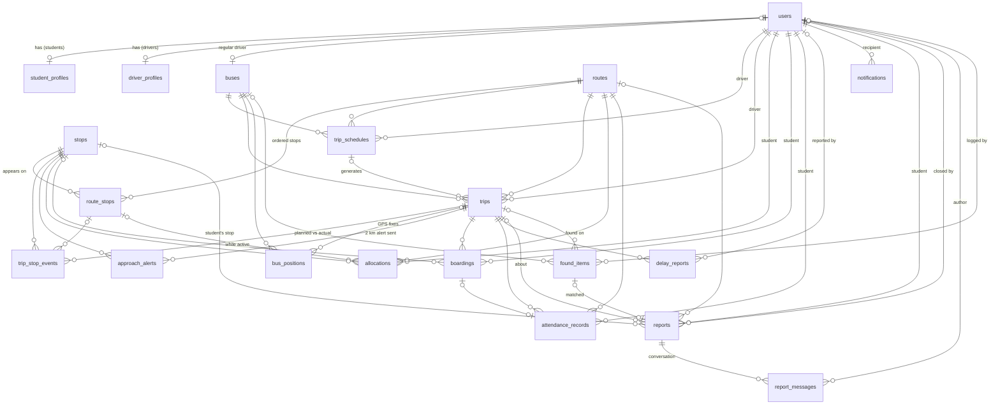

# Database design

PostgreSQL 16 · 21 tables · Alembic head `bbb63096dc6b`
This document describes the schema **as it exists in the database** (checked against the live
schema on 2026-10-02). If you change a model, update the relevant section here in the same PR.

---

## 1. Overview

One PostgreSQL database serves the whole modular monolith. **Every table has exactly one owning
module**; only that module writes it. Other modules reference it by foreign key and read it through
the owner's service (see `docs/CONTRIBUTING.md`, rule 1).

| Module | Tables it owns |
|---|---|
| core | `domain_events` |
| auth | `users`, `student_profiles`, `driver_profiles` |
| master_data | `buses`, `stops`, `routes`, `route_stops` |
| trips | `trip_schedules`, `trips`, `trip_stop_events` |
| tracking | `bus_positions`, `approach_alerts` |
| allocation | `allocations` |
| boarding | `boardings`, `attendance_records` |
| delay_monitor | `delay_reports` |
| notifications | `notifications` |
| reports | `reports`, `report_messages`, `found_items` |
| capacity, history, dashboard | *none: read-only modules* |

### Entity-relationship diagram
A full diagram with every column, coloured by owning module, is in
[database.eraser](database.eraser): paste it into a new **Entity Relationship** diagram on
[eraser.io](https://app.eraser.io). The summary below shows the relationships only.



`domain_events` has no foreign keys on purpose (see §4.1).

---

## 2. Conventions

| Topic | Rule |
|---|---|
| Primary keys | `id integer` identity (serial). High-volume logs (`domain_events`, `notifications`) use `bigint`. Profile tables use `user_id` as PK (1:1 with `users`). |
| Timestamps | Always `timestamptz`, stored in **UTC**. `created_at` / `updated_at` default `now()` (via `TimestampMixin`). |
| Local times | Wall-clock schedule times (`trip_schedules.departure_time`) are `time` in the college timezone (`TIMEZONE`, default `Asia/Kolkata`). They're converted to UTC when trips are generated. |
| Dates | `service_date`, `valid_from` are `date` in the college timezone. |
| Enums | `varchar(32)` + a `CHECK` constraint listing allowed values, **not** native PG enums (adding a value is a one-line migration). |
| Naming | `pk_<table>`, `fk_<table>_<column>_<ref table>`, `uq_<table>_<column>`, `ix_<table>_<column>`, `ck_<table>_<name>` (set in `app/core/models.py`, so Alembic diffs are stable). |
| Money/secrets | None stored. Passwords are bcrypt hashes. |
| Soft delete | Not used. Records end via status (`allocations.status = 'ended'`, `buses.status = 'retired'`, `users.is_active = false`). |

### Delete behaviour (FK `ON DELETE`)
- **CASCADE**: child is meaningless without the parent (profiles, route stops of a route, a trip's stop events/boardings/attendance/delay reports, a user's notifications).
- **RESTRICT**: deleting would destroy operational history (a bus/route/driver used by schedules or trips, a stop used by a route or past trips). Retire or deactivate instead.
- **SET NULL**: optional links (who recorded something, a trip's schedule, the stop a boarding matched).

---

## 3. Enumerations

| Column(s) | Allowed values | Meaning |
|---|---|---|
| `users.role` | `student`, `driver`, `admin` | one role per account |
| `buses.status` | `active`, `maintenance`, `retired` | only `active` buses can start trips |
| `trip_schedules.direction`, `trips.direction` | `pickup`, `drop` | pickup = stops → campus (route order); drop = campus → stops (reversed) |
| `trips.status` | `scheduled`, `in_progress`, `completed`, `cancelled` | state machine in §5.2 |
| `allocations.status` | `active`, `ended` | at most one `active` per student |
| `boardings.method` | `qr`, `manual` | student scanned the driver's QR / driver marked them |
| `attendance_records.status` | `present`, `absent`, `present_unallocated` | written when a trip ends |
| `delay_reports.source` | `start`, `stop_arrival`, `overdue`, `not_started`, `manual`, `recovered` | how the delay was detected (Team B will add `gps`, `eta_model`) |
| `notifications.severity` | `info`, `warning`, `critical` | |
| `reports.kind` | `lateness`, `overcrowding`, `safety`, `lost_item`, `other` | chosen by the student |
| `reports.status` | `open`, `replied`, `closed` | a student follow-up reopens a replied report |
| `reports.severity` | `low`, `normal`, `high`, `critical` | set by the agent; null until analysed |
| `reports.analysis_status` | `pending`, `done`, `failed` | |
| `found_items.status` | `unclaimed`, `matched`, `returned` | |

---

## 4. Tables

Legend: **PK** primary key · **FK** foreign key · **UQ** unique · ✓ = NOT NULL

### 4.1 core

#### `domain_events`: operational event log
Every state change any module publishes (`TripStarted`, `StudentBoarded`, `TripDelayed`…). The source
for the history module, the audit trail, and the feed Team B's agent reads.

| Column | Type | Null | Default | Notes |
|---|---|---|---|---|
| `id` | bigint | ✓ | identity | PK |
| `type` | varchar(64) | ✓ | | event name, e.g. `TripDelayed` |
| `aggregate_type` | varchar(32) | | | what it's about: `trip`, `bus`, `route`, `allocation`, `user`, `schedule` |
| `aggregate_id` | integer | | | id of that thing |
| `actor_id` | integer | | | user who caused it (null = system/background job) |
| `payload` | jsonb | ✓ | | event data, JSON-normalised (datetimes as ISO strings) |
| `occurred_at` | timestamptz | ✓ | `now()` | |

Indexes: `ix_domain_events_type (type)`, `ix_domain_events_aggregate (aggregate_type, aggregate_id)`,
`ix_domain_events_occurred_at (occurred_at)`, and the expression indexes
`ix_domain_events_payload_trip_id ((payload ->> 'trip_id'))` and
`ix_domain_events_payload_route_id ((payload ->> 'route_id'))` for trip timelines and route history
(query them through `events.payload_text(key)` so the key is inlined and the index matches).
Kept for good: this is the history.

*Why no FKs?* The log must survive deletions of the things it describes, and one column
(`aggregate_id`) points at different tables depending on `aggregate_type`.
Rows are written in the **same transaction** as the change they describe, so the log never
disagrees with the data.

Example payload (`TripDelayed`):
```json
{"trip_id": 7, "route_id": 1, "bus_id": 4, "driver_id": 5, "direction": "pickup",
 "delay_min": 12, "previous_delay_min": 0, "source": "stop_arrival",
 "at_sequence": 2, "at_stop_name": "Thirumangalam", "reason": null,
 "affected_stops": [{"sequence": 3, "stop_id": 3, "stop_name": "Koyambedu Market",
                     "scheduled_at": "2026-09-24T05:50:00+00:00", "expected_at": "2026-09-24T06:02:00+00:00"}]}
```

---

### 4.2 auth

#### `users`
| Column | Type | Null | Default | Notes |
|---|---|---|---|---|
| `id` | integer | ✓ | identity | PK |
| `email` | varchar(255) | ✓ | | **UQ** (`ix_users_email`), stored lower-case |
| `password_hash` | varchar(255) | ✓ | | bcrypt |
| `full_name` | varchar(120) | ✓ | | |
| `phone` | varchar(20) | | | |
| `role` | varchar(32) | ✓ | | enum, indexed (`ix_users_role`) |
| `is_active` | boolean | ✓ | `true` | deactivated users can't log in or refresh |
| `token_version` | integer | ✓ | `0` | in every token as `ver`; bumped on password change or deactivation, which ends all sessions |
| `created_at`, `updated_at` | timestamptz | ✓ | `now()` | |

#### `student_profiles` (1:1 with a `student` user)
| Column | Type | Null | Notes |
|---|---|---|---|
| `user_id` | integer | ✓ | PK, FK → `users.id` CASCADE |
| `roll_no` | varchar(32) | ✓ | **UQ** (`ix_student_profiles_roll_no`) |
| `department` | varchar(80) | | |
| `year` | smallint | | 1–6 (validated in API) |

#### `driver_profiles` (1:1 with a `driver` user)
| Column | Type | Null | Notes |
|---|---|---|---|
| `user_id` | integer | ✓ | PK, FK → `users.id` CASCADE |
| `license_no` | varchar(32) | ✓ | **UQ** |
| `license_expiry` | date | | |

---

### 4.3 master_data

#### `buses`
| Column | Type | Null | Default | Notes |
|---|---|---|---|---|
| `id` | integer | ✓ | identity | PK |
| `registration_no` | varchar(20) | ✓ | | **UQ**, stored upper-case without spaces (`TN09AB1401`) |
| `capacity` | smallint | ✓ | | seats, 1–120 (validated in API) |
| `model` | varchar(80) | | | |
| `status` | varchar(32) | ✓ | `active` | enum |
| `driver_id` | integer | | | FK → `users.id` SET NULL, **UQ**: the bus's regular driver; a driver has at most one bus |
| `created_at`, `updated_at` | timestamptz | ✓ | `now()` | |

#### `stops`
| Column | Type | Null | Notes |
|---|---|---|---|
| `id` | integer | ✓ | PK |
| `name` | varchar(120) | ✓ | |
| `landmark` | varchar(160) | | shown under the stop name |
| `latitude`, `longitude` | double precision | | used by live tracking (map, auto-arrival, 2 km alerts); a stop without them only arrives by the driver's button |
| `created_at`, `updated_at` | timestamptz | ✓ | |

#### `routes`
| Column | Type | Null | Default | Notes |
|---|---|---|---|---|
| `id` | integer | ✓ | identity | PK |
| `code` | varchar(10) | ✓ | | **UQ**, shown on the route badge (`14`) |
| `name` | varchar(120) | ✓ | | `North Loop` |
| `color` | varchar(7) | ✓ | | `#RRGGBB` line colour (identity only, never status) |
| `description` | varchar(255) | | | |
| `is_active` | boolean | ✓ | `true` | inactive routes get no trips or new allocations |
| `created_at`, `updated_at` | timestamptz | ✓ | `now()` | |

#### `route_stops`: the ordered stops of a route
| Column | Type | Null | Notes |
|---|---|---|---|
| `id` | integer | ✓ | PK |
| `route_id` | integer | ✓ | FK → `routes.id` CASCADE, indexed |
| `stop_id` | integer | ✓ | FK → `stops.id` RESTRICT |
| `sequence` | smallint | ✓ | 1 = first pickup point; **the last stop is the campus** |
| `offset_min` | smallint | ✓ | minutes after departure from stop 1 (pickup direction); non-decreasing |

Constraints: `uq_route_stops_route_seq (route_id, sequence)` **DEFERRABLE INITIALLY DEFERRED**
(lets a reorder swap sequences inside one transaction), `uq_route_stops_route_stop (route_id, stop_id)`
(a stop appears once per route).

---

### 4.4 trips

#### `trip_schedules`: recurring service
| Column | Type | Null | Default | Notes |
|---|---|---|---|---|
| `id` | integer | ✓ | identity | PK |
| `route_id` | integer | ✓ | | FK → `routes.id` RESTRICT, indexed |
| `bus_id` | integer | ✓ | | FK → `buses.id` RESTRICT |
| `driver_id` | integer | ✓ | | FK → `users.id` RESTRICT; defaults to the bus's driver on create and follows it when the bus's driver changes |
| `direction` | varchar(32) | ✓ | | enum |
| `departure_time` | time | ✓ | | college-local wall clock |
| `days_of_week` | smallint[] | ✓ | | ISO weekdays 1 = Mon … 7 = Sun |
| `is_active` | boolean | ✓ | `true` | paused schedules generate no trips |
| `created_at`, `updated_at` | timestamptz | ✓ | `now()` | |

#### `trips`: one run of a schedule on a date
| Column | Type | Null | Default | Notes |
|---|---|---|---|---|
| `id` | integer | ✓ | identity | PK |
| `schedule_id` | integer | | | FK → `trip_schedules.id` SET NULL (null = ad-hoc trip, supported) |
| `route_id` | integer | ✓ | | FK → `routes.id` RESTRICT, indexed |
| `bus_id` | integer | ✓ | | FK → `buses.id` RESTRICT |
| `driver_id` | integer | ✓ | | FK → `users.id` RESTRICT, indexed |
| `direction` | varchar(32) | ✓ | | copied from the schedule |
| `service_date` | date | ✓ | | indexed |
| `scheduled_departure` | timestamptz | ✓ | | UTC, computed from the schedule's local time |
| `status` | varchar(32) | ✓ | `scheduled` | enum, indexed |
| `started_at`, `ended_at` | timestamptz | | | |
| `current_delay_min` | smallint | ✓ | `0` | latest observed delay (last check-in) |
| `cancel_reason` | varchar(255) | | | |
| `created_at`, `updated_at` | timestamptz | ✓ | `now()` | |

Constraint: `uq_trips_schedule_date (schedule_id, service_date)`, so generating trips twice can't
duplicate them.

Partial unique indexes `uq_trips_one_running_per_driver (driver_id)` and
`uq_trips_one_running_per_bus (bus_id)`, both `WHERE status = 'in_progress'`: a driver drives, and a
bus runs, at most one trip at a time, even when two "start" requests race.

Copies of route/bus/driver/direction are deliberate: a trip records what *actually* ran even if the
schedule is later edited.

#### `trip_stop_events`: planned vs actual per stop
| Column | Type | Null | Notes |
|---|---|---|---|
| `id` | integer | ✓ | PK |
| `trip_id` | integer | ✓ | FK → `trips.id` CASCADE, indexed |
| `route_stop_id` | integer | | FK → `route_stops.id` SET NULL (route may be edited later) |
| `stop_id` | integer | ✓ | FK → `stops.id` RESTRICT |
| `stop_name` | varchar(120) | ✓ | **snapshot** of the name when the trip was planned |
| `sequence` | smallint | ✓ | visit order *within this trip* (drop trips are reversed) |
| `scheduled_at` | timestamptz | ✓ | planned time |
| `arrived_at` | timestamptz | | when the bus reached the stop: the driver's check-in or a GPS fix within 100 m (null = not reached / skipped) |
| `delay_min` | smallint | | `arrived_at − scheduled_at`, rounded minutes (negative = early) |

Constraint: `uq_trip_stop_events_seq (trip_id, sequence)`.

GPS fixes for a trip are stored by the tracking module in `bus_positions` (§4.9).

---

### 4.5 allocation

#### `allocations`: which route and stop a student rides
| Column | Type | Null | Default | Notes |
|---|---|---|---|---|
| `id` | integer | ✓ | identity | PK |
| `student_id` | integer | ✓ | | FK → `users.id` CASCADE, indexed |
| `route_id` | integer | ✓ | | FK → `routes.id` RESTRICT, indexed |
| `route_stop_id` | integer | | | FK → `route_stops.id` RESTRICT: **set only while `active`**, cleared when ended |
| `stop_id` | integer | ✓ | | FK → `stops.id` RESTRICT: the boarding stop (kept after the allocation ends) |
| `status` | varchar(32) | ✓ | | enum |
| `valid_from` | date | ✓ | | |
| `ended_at` | timestamptz | | | |
| `end_reason` | varchar(120) | | | `reassigned`, `unassigned` |
| `created_by` | integer | | | FK → `users.id` SET NULL (admin) |
| `created_at`, `updated_at` | timestamptz | ✓ | `now()` | |

Partial unique index: `uq_allocations_one_active_per_student (student_id) WHERE status = 'active'`.

*Why `route_stop_id` only while active?* The RESTRICT FK stops an admin deleting a stop students
still use, but ended allocations don't lock the route forever.

---

### 4.6 boarding

#### `boardings`
| Column | Type | Null | Notes |
|---|---|---|---|
| `id` | integer | ✓ | PK |
| `trip_id` | integer | ✓ | FK → `trips.id` CASCADE, indexed |
| `student_id` | integer | ✓ | FK → `users.id` CASCADE, indexed |
| `stop_id` | integer | | FK → `stops.id` SET NULL: the student's allocated stop if they're on this route, else null |
| `method` | varchar(32) | ✓ | enum `qr` / `manual` |
| `allocation_match` | boolean | ✓ | false = rode a route they aren't allocated to (flagged) |
| `boarded_at` | timestamptz | ✓ | |
| `recorded_by` | integer | | FK → `users.id` SET NULL: driver, for manual boarding |

Constraint: `uq_boardings_trip_student (trip_id, student_id)`: one boarding per student per trip
(race-safe duplicate protection).

#### `attendance_records`: final per-trip attendance
| Column | Type | Null | Notes |
|---|---|---|---|
| `id` | integer | ✓ | PK |
| `trip_id` | integer | ✓ | FK → `trips.id` CASCADE, indexed |
| `student_id` | integer | ✓ | FK → `users.id` CASCADE, indexed |
| `route_id` | integer | ✓ | FK → `routes.id` RESTRICT |
| `service_date` | date | ✓ | indexed (reports by day) |
| `status` | varchar(32) | ✓ | enum |
| `boarding_id` | integer | | FK → `boardings.id` SET NULL |

Constraint: `uq_attendance_trip_student (trip_id, student_id)`. Written once when the trip ends
(idempotent): allocated students → `present`/`absent`; riders without an allocation on that route
→ `present_unallocated`.

---

### 4.7 delay_monitor

#### `delay_reports`: every delay alert and recovery
| Column | Type | Null | Default | Notes |
|---|---|---|---|---|
| `id` | integer | ✓ | identity | PK |
| `trip_id` | integer | ✓ | | FK → `trips.id` CASCADE, indexed |
| `source` | varchar(32) | ✓ | | enum |
| `delay_min` | smallint | ✓ | | |
| `at_sequence` | smallint | | | stop sequence where it was observed |
| `reason` | varchar(255) | | | manual reports |
| `reported_by` | integer | | | FK → `users.id` SET NULL |
| `created_at` | timestamptz | ✓ | `now()` | |

The **latest row per trip is that trip's alert state**. A row is only written when an alert is
actually raised (threshold crossed, escalated by another threshold, recovered, or manual), so this
table is also the de-duplication memory for alerts.

---

### 4.8 notifications

#### `notifications`: in-app inbox
| Column | Type | Null | Default | Notes |
|---|---|---|---|---|
| `id` | bigint | ✓ | identity | PK |
| `user_id` | integer | ✓ | | FK → `users.id` CASCADE (recipient) |
| `type` | varchar(48) | ✓ | | usually the triggering event type |
| `title` | varchar(160) | ✓ | | |
| `body` | varchar(500) | ✓ | | personalised (e.g. the student's own stop and new time) |
| `severity` | varchar(32) | ✓ | | enum |
| `payload` | jsonb | ✓ | | `{trip_id, route_id, route_code, route_color, delay_min, stop…}` for the UI |
| `read_at` | timestamptz | | | null = unread |
| `created_at` | timestamptz | ✓ | `now()` | |

Index: `ix_notifications_user_created (user_id, created_at)`, the inbox query. Read notifications
older than `NOTIFICATION_RETENTION_DAYS` (180) are deleted by the `notification-retention` job.

---

### 4.9 tracking

#### `bus_positions`: GPS fixes from the bus (the driver's phone)
| Column | Type | Null | Notes |
|---|---|---|---|
| `id` | integer | ✓ | PK |
| `trip_id` | integer | | FK → `trips.id` CASCADE |
| `bus_id` | integer | ✓ | FK → `buses.id` CASCADE |
| `latitude`, `longitude` | double precision | ✓ | WGS84 |
| `speed_kmph` | double precision | | |
| `heading_deg` | double precision | | 0–360, north = 0 |
| `accuracy_m` | double precision | | device-reported; fixes worse than `MAX_FIX_ACCURACY_M` never trigger arrival/alerts |
| `recorded_at` | timestamptz | ✓ | when the phone took the fix (future → now); indexed |

Index: `ix_bus_positions_trip_recorded (trip_id, recorded_at)` for the latest fix and a trip's track.
About 720 rows per bus per running hour at one fix per 5 s. Fixes older than
`POSITION_RETENTION_DAYS` (90) are deleted by the `position-retention` job.

#### `approach_alerts`: "bus is 2 km away" already announced
| Column | Type | Null | Default | Notes |
|---|---|---|---|---|
| `id` | integer | ✓ | | PK |
| `trip_id` | integer | ✓ | | FK → `trips.id` CASCADE |
| `stop_id` | integer | ✓ | | FK → `stops.id` RESTRICT |
| `sequence` | smallint | ✓ | | the stop's position in that trip |
| `distance_m` | integer | ✓ | | straight-line distance when announced |
| `created_at` | timestamptz | ✓ | `now()` | |

Constraint: `uq_approach_alerts_trip_stop (trip_id, stop_id)`: each stop is announced once per trip.

---

### 4.10 reports

#### `reports`: a problem a student reported, plus the agent's analysis
| Column | Type | Null | Default | Notes |
|---|---|---|---|---|
| `id` | integer | ✓ | identity | PK |
| `student_id` | integer | ✓ | | FK → `users.id` CASCADE, indexed. Kept even when `anonymous` (staff views hide it) |
| `trip_id` | integer | | | FK → `trips.id` SET NULL: one of the student's trips from the last `REPORT_LOOKBACK_DAYS`; null = not about a trip |
| `route_id` | integer | | | FK → `routes.id` SET NULL: the trip's route, else the student's allocated route |
| `stop_id` | integer | | | FK → `stops.id` SET NULL: the student's allocated stop on that route |
| `kind` | varchar(32) | ✓ | | enum |
| `description` | varchar(1000) | ✓ | | the student's own words |
| `anonymous` | boolean | ✓ | `false` | hide the name from staff |
| `status` | varchar(32) | ✓ | `open` | enum |
| `severity` | varchar(32) | | | enum, set by the agent (rules set the minimum) |
| `analysis_status` | varchar(32) | ✓ | `pending` | enum, indexed (the retry sweeper looks for `pending`) |
| `analysis` | jsonb | | | `{claims, findings[{check, verdict, detail, numbers}], match_candidates, summary, suggested_action, draft_reply, steps}` |
| `analysed_by` | varchar(64) | | | `qwen3:4b`, `rules`, or `qwen3:4b+rules` when only one step used the model |
| `analysed_at` | timestamptz | | | |
| `matched_found_item_id` | integer | | | FK → `found_items.id` SET NULL |
| `closed_at` | timestamptz | | | |
| `closed_by` | integer | | | FK → `users.id` SET NULL |
| `resolution_note` | varchar(255) | | | shown to the student |
| `created_at`, `updated_at` | timestamptz | ✓ | `now()` | |

Index: `ix_reports_status_created (status, created_at)` for the admin inbox.

The analysis is stored as one jsonb document because it's written once per run and read whole by
the admin screen; nothing queries inside it.

#### `report_messages`: staff replies and student follow-ups
| Column | Type | Null | Notes |
|---|---|---|---|
| `id` | integer | ✓ | PK |
| `report_id` | integer | ✓ | FK → `reports.id` CASCADE, indexed |
| `author_id` | integer | | FK → `users.id` SET NULL |
| `from_staff` | boolean | ✓ | |
| `body` | varchar(1000) | ✓ | |
| `created_at` | timestamptz | ✓ | `now()` |

#### `found_items`: lost and found
| Column | Type | Null | Default | Notes |
|---|---|---|---|---|
| `id` | integer | ✓ | identity | PK |
| `trip_id` | integer | | | FK → `trips.id` SET NULL (null = handed in at the office) |
| `bus_id` | integer | | | FK → `buses.id` SET NULL |
| `logged_by` | integer | | | FK → `users.id` SET NULL (driver or admin) |
| `description` | varchar(300) | ✓ | | |
| `status` | varchar(32) | ✓ | `unclaimed` | enum, indexed |
| `embedding` | double precision[] | | | 768-number text embedding (`nomic-embed-text`) for matching; null when the model was off (matching then uses word overlap) |
| `created_at`, `updated_at` | timestamptz | ✓ | `now()` | |

---

## 5. Data flows and lifecycles

### 5.1 Rows written during one trip
| Step | Rows |
|---|---|
| Trip generated from a schedule (daily job / admin) | 1 `trips` (`scheduled`) + N `trip_stop_events` (planned times) + `domain_events: TripsGenerated` |
| Driver starts | `trips.status = in_progress`, stop 1 `arrived_at` set · `TripStarted` · possibly `delay_reports` + `TripDelayed` · `notifications` to riders |
| Student scans QR | 1 `boardings` · `StudentBoarded` (+ `UnallocatedBoarding`) · capacity may add `CapacityWarning`/`OverCapacity` events + notifications |
| Driver's phone sends GPS fixes | N `bus_positions` · within 2 km of a stop: 1 `approach_alerts` + `BusApproaching` + notifications to its riders · within 100 m: same as ARRIVED below, with `source = gps` |
| Driver taps ARRIVED (or GPS arrival) | stop `arrived_at`, `delay_min`; `trips.current_delay_min` · `StopArrived` · maybe `delay_reports` + `TripDelayed`/`TripDelayResolved` + notifications |
| Driver ends | `trips.status = completed`, last stop reached · `TripEnded` · M `attendance_records` · `AttendanceFinalized` |
| Driver never ends it (auto-close) | `trips.status = completed`, `ended_at` = last activity, unreached stops stay null · `TripEnded` with `auto_closed: true` and `actor_id` null · M `attendance_records` · `AttendanceFinalized` |

### 5.2 Trip status
```
scheduled ──start──▶ in_progress ──end / auto-close──▶ completed
    └──────cancel───────┴──────────cancel────────────▶ cancelled
```
**Auto-close:** a trip still `in_progress` after its `service_date`, with no start or stop arrival
for `STALE_TRIP_GRACE_HOURS` (default 3), is completed by the trips module. It runs every 15 minutes
and before every trip start, so a trip the driver forgot to end never blocks their next one. The
grace period keeps a late run that crosses midnight from being closed mid-route.

### 5.3 Allocation
```
(none) ──assign──▶ active ──reassign──▶ ended (+ new active row)
                     └────unassign────▶ ended
```

---

## 6. Integrity rules

| Rule | Enforced by |
|---|---|
| One active allocation per student | partial unique index |
| One boarding / one attendance row per student per trip | unique constraints |
| One trip per schedule per day | `uq_trips_schedule_date` |
| A driver has at most one regular bus | `uq_buses_driver_id` |
| A stop appears once per route; sequences unique per route | unique constraints (sequence deferred) |
| Can't delete a stop students are allocated to | FK RESTRICT from `allocations.route_stop_id` |
| Can't delete buses/routes/drivers with operational history | FK RESTRICT from schedules/trips |
| Valid enum values | CHECK constraints |
| Route offsets non-decreasing, route ends at campus, ≥2 stops to schedule | service layer (master_data / trips) |
| Seat capacity on allocation (409 unless `force`) | service layer (allocation) |
| Driver/bus not already running a trip | service layer (trips.start; trips left running from an earlier day are auto-closed first, §5.2) |
| Accounts are `student`, `driver` or `admin` only | CHECK `ck_users_user_role` |
| QR token validity (30s, signed, bound to a running trip) | service layer (boarding): tokens are not stored |
| A report is about one of the student's own recent trips | service layer (reports) |
| Only an unclaimed found item can be matched, and only to a lost-item report | service layer (reports) |

---

## 7. Query patterns → indexes

| Query | Index used |
|---|---|
| Today's trips, board, driver's runs | `ix_trips_service_date`, `ix_trips_driver_id`, `ix_trips_status` |
| Stops of a trip / route | `ix_trip_stop_events_trip_id`, `ix_route_stops_route_id` |
| Riders on a route, a student's allocation | `ix_allocations_route_id`, `uq_allocations_one_active_per_student` |
| Boarded count, roster | `ix_boardings_trip_id`, `uq_boardings_trip_student` |
| Attendance reports by day / student | `ix_attendance_records_service_date`, `ix_attendance_records_student_id` |
| Inbox, unread count | `ix_notifications_user_created` |
| Latest bus position, a trip's track | `ix_bus_positions_trip_recorded` |
| Was this stop already announced? | `uq_approach_alerts_trip_stop` |
| Admin issues inbox | `ix_reports_status_created` |
| A student's reports | `ix_reports_student_id` |
| Reports waiting for analysis | `ix_reports_analysis_status` |
| Trip timeline, alerts today, capacity de-dup | `ix_domain_events_aggregate`, `ix_domain_events_type`, `ix_domain_events_occurred_at` |
| Login | `ix_users_email` |

Known gap: history filters on `payload->>'trip_id'` / `'route_id'` aren't indexed. Add a GIN index
on `domain_events.payload` (or promote `trip_id` to a column) once the table reaches a few hundred
thousand rows.

---

## 8. Migrations

| Revision | Description |
|---|---|
| `bbfa08bf4a36` | initial P0 schema (all 17 tables) |
| `760c6592a8a4` | `buses.driver_id`: bus's regular driver (unique FK) |
| `4f1c2d7a9b3e` | tracking: `bus_positions` gains `heading_deg`, `accuracy_m`, `(trip_id, recorded_at)` index; new `approach_alerts` |
| `9d3e5b7c1a2f` | auth: `security` and `parent` roles removed (their accounts deleted); `student_profiles.parent_user_id` dropped |
| `bbb63096dc6b` | reports: new `reports`, `report_messages`, `found_items` |
| `c7a1e4f2b9d6` | review fixes: one running trip per driver/bus (partial unique indexes; extra running trips are completed first), `users.token_version`, `domain_events` payload expression indexes |

Workflow:
```bash
cd backend
# 1. change models.py in your module (and add new model modules to app/db_models.py)
alembic revision --autogenerate -m "<module>: <what changed>"
# 2. read the generated file in alembic/versions/ and fix anything autogenerate got wrong
alembic upgrade head
# 3. update this document
```
One migration history for the whole app. Pull before generating to avoid two heads; if you get
them anyway, `alembic merge heads -m "merge"`.

Tests don't use migrations: `app/conftest.py` builds the schema with `metadata.create_all()` in the
`transit_test` database, so a model change is testable before its migration exists.

---

## 9. Planned extensions (Team B / P1–P2)

| Need | Where it goes |
|---|---|
| ETA / deviation sources | new `delay_reports.source` values `gps`, `eta_model` (CHECK migration) |
| Route polylines for deviation detection | new `route_shapes` table (master_data) |
| Agent context / decisions | agent-owned tables; read `domain_events` for history |
| Push notification tokens | new `device_tokens` table (notifications) |
| Semester-based allocations | `allocations.valid_to` column |
